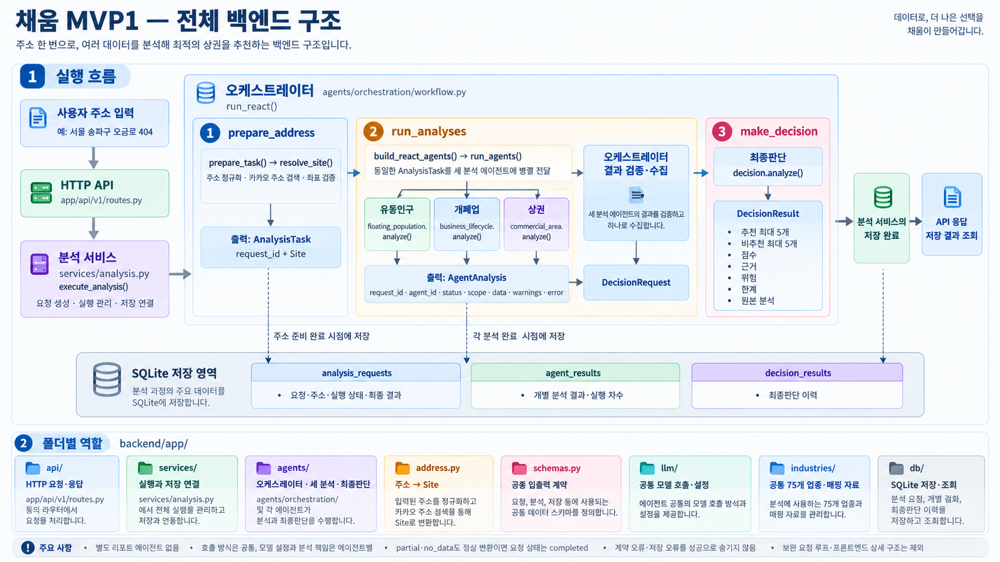

# 채움 — 공실에 맞는 업종 분석

카카오테크 캠퍼스 4기 · 강원대 1팀

상가 주소를 입력하면 유동인구·개폐업·상권 데이터를 분석하고, 해당 입지의 추천·비추천 업종과 근거를 제공합니다. 서비스 공통 업종 기준은 **소상공인 중분류 75개**입니다.

## 전체 구조



그림은 전체 구성요소의 연결 관계입니다. HTTP API는 구현되어 있으나, 현재 프론트 화면은 목업 데이터를 사용하며 실제 백엔드 연동은 별도 작업입니다.

```text
사용자 주소
  → 카카오 주소 검색 → Site·AnalysisTask 생성
  → 유동인구·개폐업·상권 에이전트 병렬 실행
  → 최종판단 에이전트 → 추천·비추천 업종과 근거
  → SQLite 저장 → HTTP API로 조회 → 프론트 표시
```

별도 리포트 에이전트는 두지 않습니다. 최종 결과에는 세 분석의 원본 결과도 포함되며, 프론트에서 이를 시각화합니다.

## 폴더 구성

| 경로 | 역할 |
| --- | --- |
| [backend/](backend/README.md) | 주소 변환, 분석·최종판단, 오케스트레이션, SQLite, HTTP API |
| [frontend/](frontend/README.md) | 랜딩·주소 입력·결과 화면 |
| `docs/agent/` | 전체 구조·에이전트별 설명 이미지 |
| `docs/` | 팀 규칙과 API 계약 문서 |

## 현재 구현 범위

| 영역 | 현재 상태 |
| --- | --- |
| 주소 준비 | 카카오 주소 검색과 후보 검증 구현 |
| 세 분석 에이전트 | 공통 입력을 받아 병렬 실행하는 경로 구현 |
| 최종판단 | 75개 업종 기준 검증, 추천·비추천 각각 최대 5개, 근거 경로 검증 |
| 저장 | 요청 상태·분석 결과·최종판단 이력을 SQLite에 저장 |
| HTTP API | 분석 실행·저장 결과 조회 구현. API 담당자와 연동 계약 확인 필요 |
| 프론트엔드 | 랜딩·입력·결과 화면 구현, 결과는 목업 사용 |
| 프론트 ↔ 백엔드 | 실제 요청·결과 조회 연결 미완료 |
| 보완 요청 | 선택 재실행 루프 미구현 |

구현 여부와 분석 품질 검증은 다릅니다. 업종 매핑 수동 검수, 근거가 실제로 해당 업종을 지지하는지, 데이터 기간·지역 범위가 적절한지는 추가 확인이 필요합니다.

## 빠르게 실행하기

### 백엔드 — 외부 호출 없는 흐름 확인

프로젝트 루트에서 실행합니다. Python **3.12**가 필요합니다.

```powershell
conda activate chaeum
python -m pip install -e "./backend[dev]"
cd backend
python examples/run_orchestration.py --mock --offline --db storage/offline.sqlite3
```

주소·분석·LLM 응답을 대역으로 사용하고, 실제 오케스트레이션·결과 검증·SQLite 저장을 실행합니다. 실제 데이터 API 연결이나 분석 품질을 검증하는 명령은 아닙니다.

설치·실제 호출·환경설정은 [백엔드 실행 안내](backend/README.md)를 참고하세요.

### 프론트엔드 — 화면 확인

프로젝트 루트의 별도 터미널에서 실행합니다.

```powershell
cd frontend
npm install
npm run dev
```

화면: <http://localhost:3000>. 서버를 띄우는 것만으로 백엔드가 자동 연결되지는 않습니다.

## 협업 문서

- [작업 기준](AGENTS.md)
- [코드 컨벤션](docs/CONVENTIONS.md)
- [Git 작업 규칙](docs/GIT_WORKFLOW.md)
- [API 계약](docs/API_CONTRACT.md)
- [공통 75개 업종·매핑](backend/app/industries/README.md)

실제 키·주소별 실행 기록·로컬 DB는 커밋하지 않습니다. 데이터 출처와 해석 한계는 분석 결과와 함께 확인합니다.
