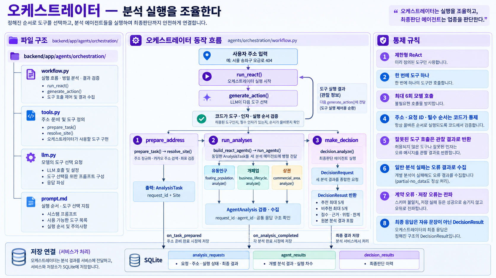
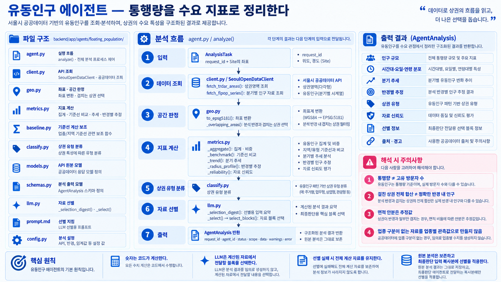
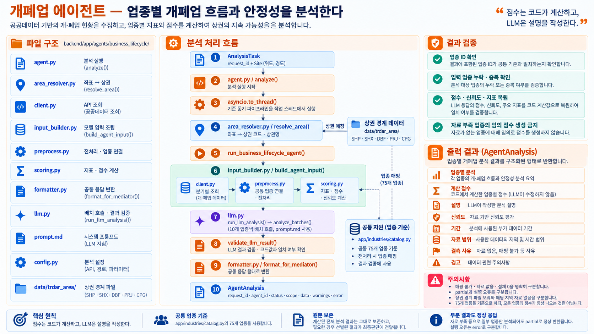
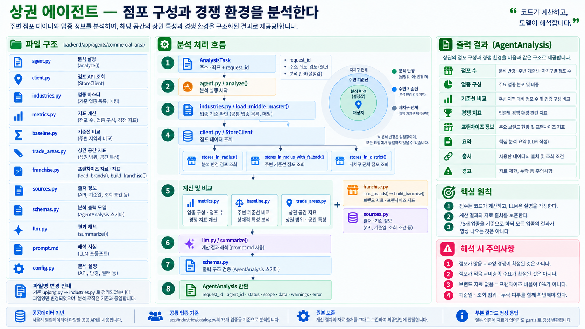
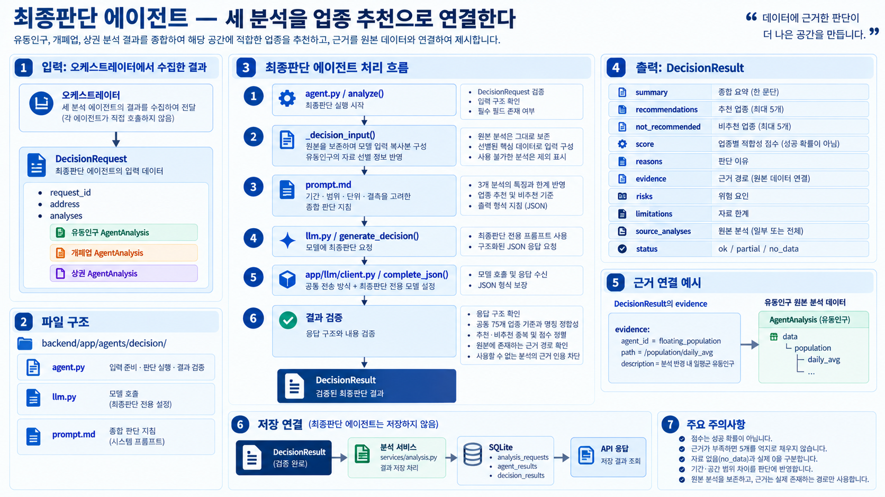

# 채움 백엔드

주소를 받아 세 분석 에이전트를 실행하고 최종판단 결과를 SQLite에 저장합니다.
**Python 3.12 · FastAPI · Pydantic · sqlite3**를 사용합니다.

## 실행 흐름과 책임

### 작업 단위 보완 — 상권·개폐업 함수 연결

`execute_analysis(..., supplements=[...])`에 `SupplementTool`을 명시적으로 주입할 때만
보완을 활성화합니다. 서비스 기본값은 빈 목록입니다.
`build_supplement_tools(settings)`로 실제 두 작업을 등록할 수 있으며 validation 도구의 일반 실행에는 연결되어 있습니다.
유동인구 원본과 HTTP API는 변경하지 않았습니다.

| 작업 | 수행 범위 | 추가 근거 |
| --- | --- | --- |
| `retry_lq_baseline` | 최초 주변 조회 실패 시 주변 자료만 재조회. 주 반경 점포 재조회 없음 | 상권 `data.supplement_lq` |
| `fetch_quarter_details` | 최초 상권·기간 그대로 최대 12분기의 원자료 조회·공통 업종 집계. 전체 분석·점수·LLM 재실행 없음 | 개폐업 `data.supplement_quarters` |

개폐업 상세 조회는 서울시 조회 단위에 따라 해당 상권·분기의 원본 업종 전체를 받습니다.
없는 분기를 채우지 않으며 원천 결측·미지원 업종과 실제 0을 구분합니다.
재조회 자료는 시점이 달라질 수 있어 원래 지표·점수·요약·주의사항을 덮어쓰지 않습니다.

```text
최초 분석 3종 → 최종판단
  ├─ 최종 결과 → 저장·종료
  └─ 보완 요청 → 등록·조건 검증 → 대상 부분 작업 → 재판단 → 저장·종료
```

- `tools.SupplementTool`: 작업 설명, `eligible(task, previous) -> bool`,
  `execute(task, previous) -> AgentAnalysis` 비동기 함수와 선택형 `accept(previous, candidate)`를 등록합니다.
- `decision.evaluate()`: 기존 판단 내용 또는 `SupplementPlan`을 반환합니다.
  기존 `decision.analyze()`는 계속 `DecisionResult`만 반환합니다.
- `orchestration/supplement.py`: 최대 한 라운드, 에이전트별 한 작업을 순서대로 실행합니다.
  전체 분석기로 대체 호출하지 않습니다. `make_decision` 안에서 코드가 실행하므로
  오케스트레이터 모델의 도구 선택 호출을 추가하지 않습니다.
- 모델에는 코드가 실행 가능하다고 판정한 작업만 제공합니다. 모델은 작업명·대상·사유만
  반환하며 주소·반경·임의 인자를 변경할 수 없습니다. 함수에는 원본의 깊은 복사본을 줍니다.
- 작업 함수는 필요한 부분만 실행한 뒤 **갱신된 전체 AgentAnalysis**를 반환해야 합니다.
  부분 JSON의 임의 병합이나 지표 재계산은 오케스트레이터가 하지 않습니다.
- 실제 두 작업은 기존 필드·범위·상태·주의사항 보존과 추가 자료의 구조·유효값을 검사합니다.
  통과하면 `partial`도 채택합니다. 원래 부족한 자료가 모두 해결됐다는 의미는 아닙니다.
  채택 검증 함수가 없는 기존 대역 작업은 이전 상태 기반 규칙을 유지합니다.
- 실행 예외·작업 시간 초과는 실패 이력으로 남기고 재판단합니다. 응답 계약·ID 불일치,
  DB 저장 실패, 두 번째 보완 요청은 성공으로 숨기지 않고 요청을 실패 처리합니다.
- 작업별로 `agent_timeout`, 전체로는 서비스의 기존 `overall_timeout`을 적용합니다.
  전체 취소·시간 초과가 나면 최초 결과와 기록된 요청은 남고 후속 작업을 실행하지 않습니다.

#### 보완 이력

DB 초기화 시 `supplement_events`를 추가합니다. 기존 테이블·자료는 유지합니다.
최종 결과가 없는 보완 요청은 `decision_results`에 가짜 판단으로 넣지 않습니다.
기존 `supplement_request_json` 예약 컬럼은 이번에도 사용하지 않습니다.

| 컬럼 | 의미 |
| --- | --- |
| `id` | 이벤트 순서 |
| `request_id` | 원래 요청 ID |
| `agent_id` | 보완 대상 |
| `status` | requested·succeeded·failed·rejected |
| `event_json` | 요청 작업·사유, 처리 메시지, 채택 여부, 반환된 분석 |
| `created_at` | UTC 기록 시각 |

보완 결과는 채택 여부와 관계없이 `agent_results.attempt=2`에 저장합니다.
계약에 맞지 않는 결과는 저장하지 않습니다. 결과와 완료 이벤트는 한 트랜잭션으로 저장합니다.
최종 `source_attempts_json`은 실제 채택한 차수를 가리킵니다.
`repository.list_supplement_events()`로 요청별 이력을 조회합니다.

외부 호출 없이 확인:

```powershell
conda activate chaeum
cd backend
python -m unittest discover -s tests -p test_supplement_loop.py -v
```

실제 보완 함수·저장·재판단 전달은 API·LLM 대역으로 검증합니다. 실제 공급자 연결과 LLM 판단 품질은 별도 시험 대상입니다.

### 요청 반경 전달 — MVP1.5 준비

상권은 `AnalysisTask.radius_m`으로 조회·면적·밀도·세부 반경을 계산합니다.
개폐업은 상권 폴리곤을 유지하며 `data.metadata.radius_applied=false`로 구분합니다.
유동인구의 요청 반경 적용은 아직 보장하지 않습니다.
서울 음식점 백분위는 500m 요청에만 적용하고, 다른 반경에서는 null입니다.

`execute_analysis(address, radius_m=300)`으로 요청 반경(미터)을 전달할 수 있습니다.
생략하면 500m이며 양의 정수만 허용합니다. 검증은 저장·외부 호출 전에 수행합니다.
세 분석 에이전트에는 동일한 `AnalysisTask.radius_m`이 전달됩니다.
상권의 실제 조회·집계에도 적용합니다. 개폐업은 폴리곤 기준이고 유동인구는 기존 설정을 사용합니다.
HTTP 입력과 최종판단 계약은 변경하지 않았습니다.

`analysis_requests.radius_m`은 요청 조건이며 실제 적용 범위가 아닙니다.
DB 초기화 시 기존 테이블에도 컬럼을 추가하며 과거 기록은 NULL로 보존합니다.
폴리곤 분석을 수행해도 입력받은 요청 반경은 지우지 않습니다.
API별 최대 지원 반경은 별도 확인이 필요합니다. 상권 주 조회가 거절되면 임의 축소하지 않습니다.

```text
HTTP API 또는 실행 스크립트
  → services.analysis.execute_analysis()
      → orchestration.run_react()
          → prepare_address: prepare_task() → address.resolve_site()
          → run_analyses: run_agents() → 세 analyze() 병렬 실행
          → make_decision: decision.analyze() → DecisionResult
      → 요청·분석 결과·최종판단 이력 저장
```

- **에이전트**는 분석 결과를 반환합니다. 저장·조회 HTTP API를 호출하지 않습니다.
- **서비스**는 오케스트레이터 실행과 DB 저장을 연결합니다.
- **저장소**는 SQLite 저장·조회 함수를 제공합니다.
- **HTTP API**는 프론트의 요청을 서비스·저장소에 연결합니다. 프론트는 DB에 직접 접근하지 않습니다.

최종판단의 `source_analyses`에 원본 분석 결과를 보존합니다. 별도 리포트 에이전트는 없습니다.

## 폴더 구성

```text
backend/
├─ app/
│  ├─ agents/
│  │  ├─ orchestration/       # 주소 준비·도구 선택·병렬 실행
│  │  ├─ floating_population/ # 유동인구 분석
│  │  ├─ business_lifecycle/  # 개폐업 분석
│  │  ├─ commercial_area/     # 상권·경쟁 분석
│  │  └─ decision/            # 최종 업종 판단
│  ├─ industries/            # 공통 75개 업종·조회·매핑
│  │  └─ data/               # 원본 CSV와 생성된 업종 JSON
│  ├─ llm/                   # 공통 모델 호출·설정
│  ├─ services/              # 실행 설정과 분석·저장 연결
│  ├─ db/                    # 연결·테이블·저장소
│  ├─ api/v1/                # HTTP 요청·응답
│  ├─ address.py             # 카카오 주소 검색·후보 검증
│  ├─ schemas.py             # 공통 입출력 계약
│  ├─ config.py              # 환경 파일 로딩
│  ├─ mocks.py               # 외부 호출 없는 대역
│  └─ main.py                # FastAPI 앱 생성
├─ examples/                # 실행 예제·목업
├─ scripts/                 # 업종 카탈로그 생성·검사
├─ tests/                   # 자동 검증
├─ storage/                 # 로컬 SQLite 파일
├─ .env.example             # 환경변수 예시
└─ pyproject.toml           # 의존성·검사 설정
```

## 에이전트별 역할

이미지는 구조를 빠르게 파악하기 위한 설명 자료입니다. 정확한 입출력은 [schemas.py](app/schemas.py), 실행 동작은 현재 코드를 기준으로 확인합니다.

<details>
<summary>오케스트레이터 — 순서 통제와 결과 수집</summary>



- `workflow.py`: `prepare_task()`, `build_react_agents()`, `run_agents()`, `run_react()`.
- `tools.py`: 도구 정의. `llm.py`: 도구 선택 모델 호출. `prompt.md`: 실행 규칙.
- 주소 준비 → 세 분석 병렬 실행 → 최종판단 순서를 코드로 통제합니다.
- 한 번에 도구 하나, 최대 6회 모델 호출의 제한형 ReAct입니다. 반환값은 모델의 안내 문장이 아닌 `DecisionResult`입니다.

</details>

<details>
<summary>유동인구 — 규모·시간대·추세 분석</summary>



- `agent.py`의 `analyze()`가 분석 진입점입니다.
- `metrics.py`: 집계·기준선·추세·반경·신뢰도 계산.
- `geo.py`: 좌표·상권 겹침 판정. `llm.py`: 자료 선별과 실패 시 대체 처리.
- 유동인구는 업종별 관측치가 아닌 공통 수요 자료입니다. 75개 업종으로 인구를 임의 배분하지 않습니다.

</details>

<details>
<summary>개폐업 — 업종 매핑·추이·상대 점수</summary>



- `agent.py`의 `analyze()`가 공통 입력을 받습니다. 기존 동기 작업은 스레드로 격리합니다.
- `input_builder.py`: 모델 입력 조립. `preprocess.py`: 전처리.
- `scoring.py`: 점수 계산. `formatter.py`: 출력 변환.
- `llm.py`: 배치 호출·응답 검증. `prompt.md`: 분석 지침.
- 서울시 원본 업종을 공통 업종으로 집계한 뒤 지표를 계산합니다. 미지원·결측·불완전 관측·실제 0을 구분합니다.

</details>

<details>
<summary>상권 — 점포 분포·경쟁 분석</summary>



- `agent.py`의 `analyze()`가 점포 조회·지표 계산·요약을 연결합니다.
- `industries.py`가 분석에 필요한 업종 마스터를 읽고 씁니다.
- 공통 중분류 기준으로 점포를 집계하고 매핑되지 않은 점포는 별도 표시합니다.
- 자료 누락·프랜차이즈 정보 부재 등은 결과 상태와 주의사항에 반영합니다.

</details>

<details>
<summary>최종판단 — 추천·비추천과 근거 검증</summary>



- `agent.py`의 `analyze()`가 `DecisionRequest`를 받아 `DecisionResult`를 반환합니다.
- `llm.py`·`prompt.md`: 모델 호출과 판단 지침.
- 추천·비추천은 각각 최대 5개입니다. 근거가 부족하면 5개를 억지로 채우지 않습니다.
- 공통 75개 업종의 명칭·대분류·중복과 근거 경로를 검증합니다.
- 경로가 존재한다는 검증과 그 자료가 해당 업종의 판단을 지지한다는 의미 검증은 다릅니다.

</details>

<details>
<summary>에이전트 구현 규칙</summary>


공통 계약은 `schemas.py`를 따릅니다. 모델 호출 방식은 `app/llm/`에서 공유하고, 모델 설정·프롬프트·분석 책임은 에이전트별로 유지합니다.

</details>

## 설치

프로젝트 루트에서 실행합니다.

```powershell
conda activate chaeum
python --version
python -m pip install -e "./backend[dev]"
cd backend
```

Python 버전은 `3.12.x`여야 합니다. Conda 환경이 없다면 먼저 `conda create -n chaeum python=3.12`로 생성합니다.

이하 명령은 별도 안내가 없으면 `backend/` 기준입니다.

## 실행 방법

| 실행 방식 | 데이터 | LLM | 확인 범위 |
| --- | --- | --- | --- |
| `run_orchestration.py --mock --offline` | 완성된 분석 결과 목업 | 대역 | 흐름·계약·DB 저장 |
| `run_orchestration.py --mock` | 완성된 분석 결과 목업 | 실제 | 오케스트레이터·최종판단 모델 연결 |
| `run_api_mock.py` | 데이터 API 원본 응답 목업 | 실제 | 유동인구·상권 전처리와 모델 연결 |
| HTTP API 실제 모드 | 실제 API | 실제 | 주소부터 분석·저장까지 |

### 외부 호출 없이 실행

```powershell
python examples/run_orchestration.py --mock --offline --db storage/offline.sqlite3
```

키가 있어도 외부 API·LLM을 호출하지 않습니다. 개롱역 올리브영 시나리오의 가상 주소 자료·좌표·분석 결과를 사용하므로 실제 입지 판단에는 사용할 수 없습니다.

### 모델 연결 확인

```powershell
python examples/run_orchestration.py --mock
python examples/run_api_mock.py --input examples/fixtures/api_responses.json
```

두 명령 모두 **실제 LLM 호출 비용이 발생**합니다.

`run_api_mock.py`는 유동인구·상권의 실제 파싱·전처리·계산을 실행합니다. 이 예제에서만 개폐업을 `AGENT_NOT_CONNECTED`로 대체합니다. 전체 세 에이전트의 실제 연결 성공을 의미하지 않으며, `--offline` 옵션은 없습니다.

### HTTP 서버 실행

```powershell
$env:MOCK_MODE = "1"
python -m uvicorn app.main:create_app --factory --reload
```

API 문서: <http://127.0.0.1:8000/docs>

실제 호출로 전환하려면 서버를 중단하고 `Remove-Item Env:MOCK_MODE`를 실행한 뒤, `.env`의 `MOCK_MODE`도 비우고 다시 시작합니다. 실제 모드에서는 카카오·데이터 API·LLM을 호출합니다.

| 경로 | 현재 동작 |
| --- | --- |
| `POST /api/v1/analyses` | `{"address":"서울특별시 송파구 오금로 404"}`를 받아 분석·저장 후 최종 결과 반환 |
| `GET /api/v1/analyses/{request_id}` | 저장된 요청 상태·주소·Site·결과·오류 조회 |
| `GET /health` | 서버 상태 확인 |

POST는 분석 완료까지 기다립니다. 즉시 작업 ID를 반환하는 백그라운드 작업 API가 아닙니다. 별도의 저장 전용 HTTP API도 없습니다.

현재 HTTP 구현은 유지되지만 **프론트 연동은 미완료**입니다. API 담당자와 최종 응답·오류 계약을 확인해야 하며, 에이전트 실행을 위해 HTTP 경로를 거칠 필요는 없습니다.

로컬 `validation_tool/`이 있는 경우 루트에서 `python validation_tool/run.py --address "서울특별시 송파구 오금로 404"`로 실제 분석과 trace를 확인할 수 있습니다. 이 도구는 서비스를 직접 호출하며 Git 공유 대상이 아닙니다.

## 환경설정

기존 `.env`가 없다면 [.env.example](.env.example)을 복사해 `.env`를 만들고 값을 채웁니다. 실제 키는 커밋하지 않습니다.

| 변수 | 용도 |
| --- | --- |
| `GEOCODING_API_KEY` | 카카오 REST API 주소 검색 |
| `FLOATING_POPULATION_API_KEY` | 서울시 유동인구 |
| `BUSINESS_LIFECYCLE_API_KEY` | 서울시 개폐업 |
| `COMMERCIAL_AREA_API_KEY` | 소상공인 상가정보 |
| `FRANCHISE_API_KEY` | 공정위 브랜드 정보 |
| `BUSINESS_LIFECYCLE_AREA_SHP_PATH` | 개폐업 상권영역 SHP 경로 재정의 |
| `ELICE_API_KEY`, `ELICE_BASE_URL`, `ELICE_MODEL` | 공통 모델 연결 |
| `{에이전트}_LLM_*` | 에이전트별 모델·키·URL·토큰·제한시간 설정 |
| `LLM_REASONING_EFFORT` | 모델이 지원할 때만 설정. 미설정 시 전송하지 않음 |
| `SQLITE_PATH` | DB 경로. 기본 `storage/chaeum.sqlite3` |
| `ANALYSIS_AGENT_TIMEOUT_SECONDS` | 개별 분석 제한시간, 기본 180초 |
| `ANALYSIS_TIMEOUT_SECONDS` | 전체 실행 제한시간, 기본 600초 |
| `CORS_ALLOW_ORIGINS`, `MOCK_MODE` | HTTP 서버 설정 |

환경 파일은 서버·CLI 시작 지점에서 읽습니다. 모델 설정 우선순위는 **직접 주입 → 에이전트별 값 → 공통 값 → 코드 기본값**입니다. 도구 호출·JSON 출력·reasoning 옵션 지원 여부는 선택한 모델로 확인해야 합니다.

개폐업 상권영역 파일의 실제 배포 여부를 확인하고, 외부 경로 사용 시 SHP·SHX·DBF·PRJ 등 구성 파일을 함께 준비합니다. 상권 코드 강제 지정 설정이 남아 있으면 입력 주소와 다른 상권을 분석할 수 있습니다.

## 저장·실패 처리

| 테이블 | 저장 내용 |
| --- | --- |
| `analysis_requests` | 요청 주소·Site·실행 상태·최종 결과 스냅샷·실패 사유 |
| `agent_results` | 세 분석 에이전트의 요청별·실행 차수별 결과 |
| `decision_results` | 최종판단 이력·참조한 분석 차수·보완 요청 저장 필드 |

최종판단은 `agent_results`가 아닌 `decision_results`에 기록하며, 최종 결과 스냅샷은 `analysis_requests.result_json`에도 저장합니다. 보완 요청·처리 이력은 `supplement_events`에 별도로 기록합니다.

- 요청 상태: `pending → running → completed / failed`.
- 분석 상태: `ok / partial / no_data / error`. 최종판단이 `partial`·`no_data`여도 정상 반환·저장되면 요청은 `completed`입니다.
- 일반 분석 실패는 오류 결과로 수집합니다. 계약·ID 불일치와 DB 저장 실패는 성공으로 처리하지 않습니다.
- 주소 준비와 개별 분석 완료 시 중간 결과를 저장합니다. 최종판단 실패 시에도 저장된 분석은 유지합니다.
- SQLite 상대 경로는 실행 위치와 관계없이 `backend/` 기준입니다.
- 취소·시간 초과가 발생해도 이미 시작한 동기 스레드를 강제 종료할 수는 없습니다.

## 공통 업종과 남은 검증

[app/industries/](app/industries/README.md)가 공통 75개 업종과 매핑의 기준입니다.

- 원본: `industries/data/*.csv`.
- 생성물: `catalog.py`, `industries/data/industry_master.json`. 생성물을 직접 수정하지 않습니다.
- 서울시 업종 매핑 99건 중 모델 판정 53건은 사람 검수가 필요합니다.
- 자료 없음·매핑 불가·실제 0을 구분하고, 비율은 가능한 원시 분자·분모에서 재계산합니다.
- 근거 경로의 업종 일치, 기간·반경 차이 해석, 실제 추천 품질은 별도 검증 대상입니다.
- 판단에 필요한 정보가 부족하면 등록된 보완 작업을 최대 한 라운드 실행합니다. 서비스 호출자는 등록표를 명시적으로 전달해야 합니다.
- 보완 요청은 판단 질문·부족한 정보·필요 이유·예상 영향을 포함합니다. `partial`만으로 자동 재조회하지 않습니다.
- 재판단에 원래 질문과 실행·채택 결과를 전달합니다. 실행 성공이 질문 해결을 의미하지는 않습니다.

## 검사

```powershell
python -m ruff check .
python -m ruff format --check .
python -m mypy
python -m unittest discover -s tests -v
python scripts/build_industry_catalog.py --check
```

자동 테스트는 외부 API·LLM을 대역으로 검증합니다. 통과하더라도 실제 공급자 연결이나 추천 품질이 검증된 것은 아닙니다.

## 관련 문서

- [공통 입출력 정의](app/schemas.py)
- [DB 테이블 정의](app/db/schema.sql)
- [팀 작업 기준](../AGENTS.md)
- [API 계약](../docs/API_CONTRACT.md)
