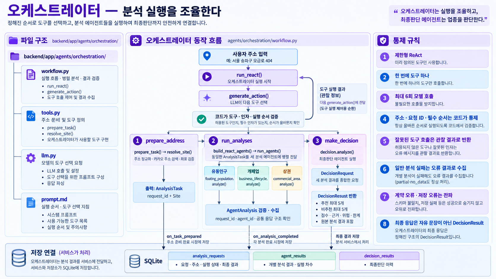
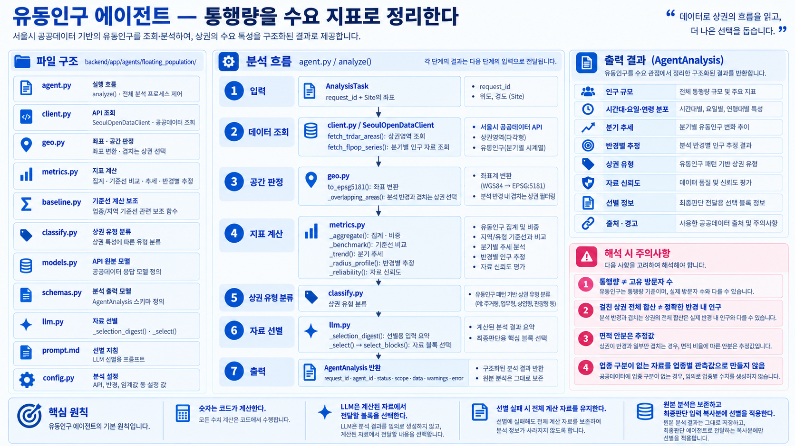
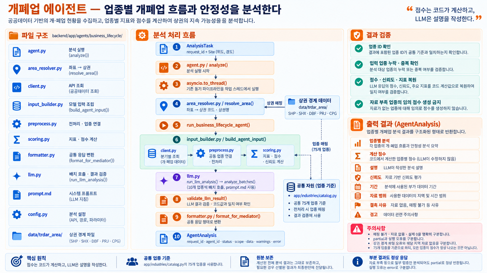
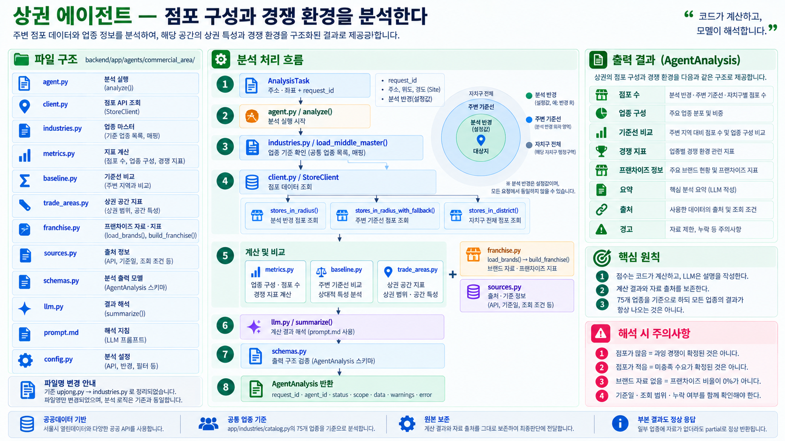
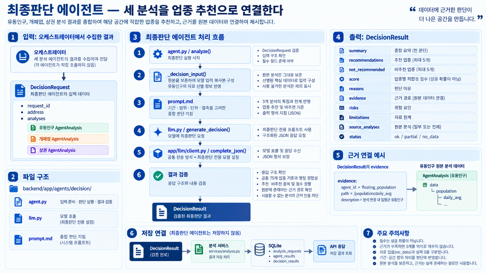

# 채움 백엔드

빈 상가 주소 하나를 받아 인구·개폐업·상권 자료를 계산하고, 그 자리에 맞는 업종과 맞지 않는 업종을
근거와 함께 돌려줍니다. 결과와 실행 이력은 SQLite에 저장합니다.

**Python 3.12 · FastAPI · Pydantic · LangGraph · sqlite3 · httpx(비동기)**

## 한눈에 보기

```text
주소 → 좌표(address.py)
     → 세 분석 병렬 실행: 유동인구 · 개폐업 · 상권        (코드 계산, LLM 없음)
     → [multi_agent만] 세 전문가 브리핑 병렬              (LLM이 원자료를 읽고 요약)
     → 최종판단(decision)                                (LLM)
          ├─ 최종 결과 → 저장
          ├─ 보완·지도 조회 / 전문가 되묻기 → 재판단
          └─ 임대인 질문 → 저장·대기 → 답변 후 재개
     → SQLite 저장 → API 조회
```

원칙은 하나입니다. **숫자는 코드가 만들고, LLM은 숫자를 만들지 않습니다.**
LLM은 코드가 계산한 값을 읽고 판단·설명하며, 모든 근거는 원자료의 실제 경로(JSON Pointer)로 인용합니다.
코드는 그 경로가 실제로 있는지, 판단한 업종의 자료인지, 문장의 숫자가 원자료 값과 같은지 검증합니다.

## 실행 모드

| 모드 | 흐름 | 상태 |
| --- | --- | --- |
| `single_decision` | 세 분석 → 판정관이 한 번에 종합. 필요하면 보완·지도·질문 1회씩 | **기본값** |
| `multi_agent` | 세 분석 → 전문가 브리핑 → 판정관이 전문가에게 되물은 뒤 종합 | 선택. 평가 중 |

`backend/.env`의 한 줄로 정합니다. 서버가 켜질 때 한 번 읽으므로 바꾼 뒤에는 서버를 재시작합니다.

```text
ANALYSIS_MODE=single_decision
ANALYSIS_MODE=multi_agent
```

- 값이 없으면 `single_decision`입니다. 요청마다 고르는 API 옵션은 없습니다.
- 모드는 요청과 함께 저장됩니다. 서버 모드를 중간에 바꿔도 이미 받은 요청의 조회·질문 재개는 저장된 모드로 이어집니다.
- 검증 도구는 `.env`를 고치지 않고 실행할 때만 바꿀 수 있습니다(아래 [실행 방법](#실행-방법)).

## LangGraph 실행 구조

### 평가자 사용 설정

| 환경변수 | 기본 | 설명 |
| --- | --- | --- |
| `BRIEFING_ENABLED` | 미설정 | `true`/`false` 또는 `1`/`0`, 대소문자 무관. `ANALYSIS_MODE`보다 우선하며 충돌 시 경고 |
| `EVALUATORS_ENABLED` | `false` | 심사자·예비 창업자·동네 손님·임대인 대변인이 초안을 한 번 평가 |
| `EVALUATOR_LLM_MODEL`·`API_KEY`·`BASE_URL` | 공통 설정 | 실제 이름은 각각 `EVALUATOR_LLM_` 접두어를 사용 |
| `EVALUATOR_LLM_MAX_TOKENS`·`REASONING_EFFORT`·`TIMEOUT_SECONDS` | 공통 설정 | 미설정이면 `ELICE_*`·`LLM_*` 값 사용 |
| `ANALYSIS_TIMEOUT_SECONDS` | 평가자 꺼짐 600초, 켜짐 1200초 | 명시한 값이 기본값보다 우선 |

| 브리핑 | 평가자 | 구성 |
| --- | --- | --- |
| 꺼짐 | 꺼짐 | 단독 판정 |
| 켜짐 | 꺼짐 | 브리핑 후 판정 |
| 꺼짐 | 켜짐 | 단독 초안 → 평가자 4명 → 지적별 반영 후 최종판단 |
| 켜짐 | 켜짐 | 브리핑·되묻기 → 초안 → 평가자 4명 → 추가 확인·최종판단 |

평가자 사용 시 모델 호출 상한은 **64회**, 브리핑 되묻기는 **초안 최대 2라운드 + 평가 후 별도 4라운드**입니다.
평가자 4회와 최종판단·교정 2회의 몫을 전문가 배분에서 보호합니다. 한도는 최대치이며 항상 소진하지 않습니다.
초안이 `no_data`이거나 평가 예산이 부족하면 생략합니다. 모두 실패하거나 성공한 평가자 전원이 지적 없이 동의하면 최종판단 재호출도 생략합니다.
질문은 평가 이후에만 발행하며, 답변 재개와 평가 후 실패 재시도는 저장된 평가를 재사용합니다.
평가 전 실패 재시도는 저장된 분석·브리핑으로 초안 → 평가 → 최종판단을 실행합니다. 원자료를 다시 조회하지 않습니다.
평가자 사용 요청은 시작 시 정한 전체 제한시간도 저장하여 재개·재시도에 유지합니다.
평가자 켜짐 여부도 요청에 저장되어 이후 환경변수를 바꿔도 유지됩니다.

저장 표는 `evaluation_drafts`(초안), `evaluations`(4명 의견), `evaluation_logs`(지적별 반영 기록)입니다.
초안과 4명 의견은 한 트랜잭션으로 저장하고, 내부 `notes`는 API에 공개하지 않습니다.
기존 DB 초기화 시 전문가 답변 표의 라운드 제약을 6으로 확장하며 기존 행을 보존합니다.
아래 기존 한도 표는 평가자를 끈 경우입니다. 평가자 사용 시 위 확장 한도를 적용합니다.

`services/analysis.py`의 `execute_analysis()`가 입력을 검증하고 `agents/orchestration/graph.py`의 `run_graph()`를 호출합니다.
순서는 고정 엣지로 정하고, 최종판단 결과에 따라서만 분기합니다. 순서를 고르는 오케스트레이터 LLM은 없습니다.

| 노드 | 역할 | 모드 |
| --- | --- | --- |
| `prepare_address` | 주소 변환, `AnalysisTask` 생성, Site 저장 | 공통 |
| `run_analyses` | 세 분석 병렬 실행, 개별 결과 저장 | 공통 |
| `write_briefs` | 세 전문가 브리핑 병렬 작성 | multi_agent |
| `evaluate_decision` | 최종판단. 결과에 따라 종료 또는 아래 노드로 이동 | 공통 |
| `evaluate_draft` | 평가자 4명 병렬 평가 후 최종판단으로 이동 | 평가자 사용 시 |
| `execute_supplement` | 등록된 부분 작업(보완)만 실행하고 재판단 | single_decision |
| `execute_map` | 같은 좌표·반경으로 지도 검색 후 재판단 | single_decision |
| `consult` | 판정관 질문을 전문가에게 보내고 답변을 모아 재판단 | multi_agent |
| `ask_user` | 임대인 질문 저장 후 대기 | 공통 |

- 그래프 상태는 요청별 메모리에 둡니다. 질문 대기 지점만 SQLite에 저장하고, 답변이 오면 최종판단부터 재개합니다.
  최초 분석·브리핑은 다시 실행하지 않습니다. 실행 중 강제 종료의 자동 복구는 지원하지 않습니다.
- `recursion_limit=32`, 외부 LangSmith 추적은 끄고 로컬 validation trace를 씁니다.

### 한도

| 항목 | single_decision | multi_agent |
| --- | --- | --- |
| 보완 | 1라운드 | 전문가가 자기 도구로 실행 |
| 지도 조회 | 1배치·최대 8개 검색 | 지도 전문가가 실행 |
| 전문가 되묻기 | 없음 | 최대 2라운드, 라운드당 3명, 전문가당 질문 1개 |
| 임대인 질문 | 1회·최대 3항목 | 1회·최대 3항목. 답변 뒤에는 되묻기만 가능 |
| 판정 출력 교정 | 1회 | 1회 |
| 모델 호출 | 판정·교정·지도 매핑 | 요청당 24회(`llm/budget.py`의 `MAX_CALLS`). 마지막 2회는 최종판단·교정 몫 |
| 전체 시간 | 600초(질문 대기 제외) | 600초(질문 대기 제외) |

## 폴더 구성

실제 서비스가 쓰는 코드만 적었습니다.

```text
backend/
├─ app/
│  ├─ main.py                # FastAPI 앱 생성
│  ├─ api/v1/                # HTTP 요청·응답
│  ├─ services/              # 실행 설정, 분석 실행과 저장 연결
│  ├─ schemas.py             # 에이전트 사이 공통 계약 (유일한 기준)
│  ├─ evidence.py            # 근거 경로 색인·검증 (판정관·전문가 공용)
│  ├─ address.py · geo.py    # 카카오 주소 검색, 좌표 변환
│  ├─ seoul.py               # 서울 API 비동기 전송·본문 검증
│  ├─ llm/                   # 모델 호출·설정, 요청별 호출 예산(budget.py)
│  ├─ db/                    # 연결·테이블(schema.sql)·저장소
│  ├─ industries/            # 공통 75개 중분류 업종·매핑
│  └─ agents/
│     ├─ orchestration/      # 그래프, 병렬 실행, 보완, 전문가 도구 연결(consult.py)
│     ├─ decision/           # 판정관: 지시문(prompt.md), 입력 구성(context.py), 근거 검증
│     ├─ specialists/        # 전문가 공통 실행기와 지시문 (multi_agent)
│     ├─ floating_population/  # 유동·상주·직장 인구 계산
│     ├─ business_lifecycle/   # 개폐업 계산·상대 점수
│     ├─ commercial_area/      # 점포 분포·경쟁·LQ 계산
│     └─ map_analysis/         # 카카오맵 주변 업종·시설 조회
├─ examples/                 # 실행 예제·목업
├─ scripts/                  # 업종표 생성·검사, 인구 스냅샷·상권 영역·밀도 기준선·업종 마스터 갱신
├─ tests/                    # 자동 검증
├─ storage/                  # 로컬 SQLite 파일
├─ .env.example              # 환경변수 예시
└─ pyproject.toml            # 의존성·검사 설정
```

전문가 4명은 따로 폴더를 두지 않습니다. `specialists/`의 공통 실행기 하나에 역할별 도구를 붙이며,
그 도구는 기존 분석 폴더의 계산 결과와 보완 함수입니다.

## 에이전트별 역할

이미지는 이전 구조의 설명 자료입니다. 정확한 입출력은 [schemas.py](app/schemas.py), 동작은 현재 코드를 기준으로 확인합니다.

<details>
<summary>오케스트레이션 — 순서 통제와 결과 수집</summary>



- `graph.py`: 노드·고정 엣지·선택 분기. `workflow.py`: `prepare_task()`, `run_agents()`, 보완 도구 등록표.
- `supplement.py`: 보완 작업 실행. `consult.py`: 전문가별 도구 정의와 지도 관측 채택 규칙.
- 최종 결과는 `DecisionResult`, 질문 대기는 `WaitingForInput`입니다.

</details>

<details>
<summary>유동인구 — 규모·시간대·추세 계산</summary>



- `agent.py`의 `analyze()`가 진입점입니다. `metrics.py`: 집계·기준선·추세·반경·신뢰도. `geo.py`: 상권 겹침 판정.
- 공통 수요 자료입니다. 75개 업종으로 인구를 임의 배분하지 않습니다.
- 유동(명/일), 상주, 직장 인구는 모집단이 달라 더하지 않습니다.

</details>

<details>
<summary>개폐업 — 업종 매핑·추이·상대 점수</summary>



- `agent.py`의 `analyze()`가 진입점입니다. 서울 API는 비동기로, SHP 읽기는 스레드로 격리합니다.
- `input_builder.py` → `preprocess.py` → `scoring.py` → `formatter.py`. 내부 LLM 호출은 없습니다.
- 폐업률은 "석 달 평균(%/분기)"입니다. 연간 폐업 확률로 바꾸지 않습니다.
- 미지원·결측·불완전 관측·실제 0을 구분합니다.

</details>

<details>
<summary>상권 — 점포 분포·경쟁 계산</summary>



- `agent.py`의 `analyze()`가 점포 조회·지표 계산·요약을 연결합니다. 요약은 `summary.py`의 규칙으로 만듭니다.
- 공통 중분류로 점포를 집계하고, 매핑되지 않은 점포는 따로 표시합니다.
- LQ는 업종 구성비를 비교 지역과 나눈 값입니다. 점포 수·매출의 배수가 아닙니다.

</details>

<details>
<summary>지도 — 주변 업종·시설 조회</summary>

- `agent.py`의 `observe()`가 같은 좌표·반경으로 카카오맵을 검색합니다.
- 원본 장소를 보존하고, 업종 검색 표본만 LLM으로 질문 업종의 동종 여부로 판단합니다(장소명을 쓰지 않은 확정 판단만 7일 캐시).
- 조회 시점의 등록 정보입니다. 분기 통계와 더하거나 폐업률 분모로 쓰지 않습니다.
- 사용법은 [지도 도구 README](app/agents/map_analysis/README.md)를 봅니다.

</details>

<details>
<summary>전문가 (multi_agent) — 원자료 요약과 되묻기 답변</summary>

- `specialists/agent.py`: `write_brief()`는 브리핑, `answer_query()`는 판정관 질문에 대한 답변을 만듭니다.
- 전문가는 자기 원자료와 도구 결과만 읽습니다. 다른 전문가와 직접 대화하지 않습니다.
- 도구는 차례 안에서 하나씩 고르고, 마지막 차례에는 정리(`finish`)만 허용합니다.
  되묻기 때는 남은 호출 수를 질문받은 전문가 수로 나눠 차례를 배정합니다.
- 브리핑은 `source`(상태·범위·경고·설명)와 `facts`(인용 가능한 값)를 받습니다. `facts.shared`는 공통 값,
  `facts.industries[업종 코드]`는 업종 값이며 부모 경로별로 묶습니다. 인용 경로는 `부모 + "/" + 필드명`입니다.
  최상위 부모는 빈 문자열이고 JSON Pointer 이스케이프를 그대로 유지합니다.
- 되묻기 입력은 질문한 업종의 facts와 공통 facts 전체만 포함합니다. 다른 업종은 읽기 도구로 확인합니다.
  읽기·보완 도구 결과도 같은 facts 형식이며 보완 후에는 최신 원자료에서 다시 만듭니다.
- 지도 입력은 질문 업종·시설의 `citations`와 검색 요약만 줍니다. 검색 도구 결과에는 해당 업종의 누적 동종
  인용 목록만 담고 전체 장소 자료는 보내지 않습니다. 캐시는 같은 형식이며 실패·미채택은 상태와 오류만 줍니다.
- `SourceIndex`는 경로·스칼라·반경을 한 번에 모읍니다. 판정관 입력 작성에서는 자료별 색인을 재사용하지만
  판정관 입력의 모양과 근거 검증 기준은 유지합니다.
- 주장마다 경로·업종·숫자를 코드가 검증합니다. 틀린 주장은 그 주장만 빼고, 남는 주장이 없으면 원자료 요약으로 대체합니다.
- 브리핑 문장은 판정관에게 주는 안내입니다. 판정관은 원자료 경로만 근거로 인용합니다.

| 전문가 | 쓸 수 있는 도구 |
| --- | --- |
| `floating_population` | 인구 요약, 분기 추세, 시간대, 서울 비교 |
| `business_lifecycle` | 업종 지표·업종 비교, 분기 상세 재조회(`fetch_quarter_details`) |
| `commercial_area` | 업종별 점포 수, 반경별 구성, 자치구 특화, 비교 상권 재조회(`retry_lq_baseline`) |
| `map_analysis` | 주변 동종 점포 검색, 주변 시설 검색 |

</details>

<details>
<summary>최종판단(판정관) — 추천·비추천과 근거 검증</summary>



- `agent.py`의 `evaluate()`가 최종 결과 또는 다음 행동(보완·지도·되묻기·질문)을 반환합니다.
- `prompt.md`: 판단 지침. multi_agent 입력은 `context.py`의 `build_context()`가 코드로 만듭니다.
- 추천·비추천은 각각 최대 5개입니다. 근거가 부족하면 억지로 채우지 않습니다.
- 근거 검증 오류는 7종입니다. 실패하면 같은 업종의 후보 경로를 최대 8개 제시하고 1회 교정합니다.
  코드가 경로를 대신 바꿔 넣지는 않습니다.
- 경로가 있다는 검증과 그 자료가 판단을 지지한다는 의미 검증은 다릅니다. 의미는 사람 평가 대상입니다.

</details>

## 선택 기능 상세

### 보완 (single_decision)

판정관이 판단에 꼭 필요한 정보가 부족하다고 볼 때만 등록된 부분 작업을 한 라운드 실행합니다.
HTTP 실제 실행은 `build_supplement_tools()`로 두 작업을 등록합니다. 인구 보완은 없습니다.

| 작업 | 수행 범위 | 추가 근거 |
| --- | --- | --- |
| `retry_lq_baseline` | 최초 주변 비교 조회가 실패했을 때 주변 자료만 재조회 | 상권 `data.supplement_lq` |
| `fetch_quarter_details` | 같은 상권·기간의 최대 12분기 원자료 조회. 점수·LLM 재실행 없음 | 개폐업 `data.supplement_quarters` |

- 판정관은 작업명·판단 질문·부족한 정보·필요 이유·예상 영향만 적습니다. 주소·반경·인자는 바꿀 수 없습니다.
- 재조회 자료는 원래 지표·점수·주의사항을 덮어쓰지 않습니다. 결과는 `agent_results.attempt=2`에 저장합니다.
- 실행 예외·시간 초과는 실패 이력으로 남기고 재판단합니다. 계약·ID 불일치와 저장 실패는 요청 실패로 처리합니다.

### 지도 조회

HTTP 요청의 `with_map=true`일 때만 연결합니다. single_decision은 판정관이 최대 1배치·8개 검색을 요청하고,
multi_agent는 지도 전문가가 검색합니다. 요청·결과는 `map_observations`에 차수별로 남기며,
기존에 확정한 장소·업종을 잃는 새 관측은 채택하지 않습니다. 답변 후 재개 때는 다시 조회하지 않습니다.

### 임대인 질문과 재개

HTTP 요청의 `allow_questions=true`일 때만 질문할 수 있습니다. 대상은 층수·전용면적·공간 상태·기존 시설·희망/제외 업종입니다.

- 질문이 있으면 `WaitingForInput`을 반환하고 요청 상태를 `waiting_for_input`으로 저장합니다.
- `POST /answers`로 답하면 최종판단부터 재개합니다. `answers=[]`는 전체 건너뛰기입니다.
- 답변은 임대인이 준 정보입니다. 시설·용도·자격·법률상 입점 가능성을 검증한 자료가 아닙니다.
- multi_agent는 v2 질문 스냅샷으로 브리핑·되묻기 차수·예산·경과 시간을 함께 복원합니다.

### 요청 반경과 실제 자료 범위

반경은 기본 500m이며 양의 정수만 받습니다. 세 분석에 같은 값이 전달되지만 실제 자료 범위는 서로 다릅니다.

| 분석 | 실제 범위 |
| --- | --- |
| 상권 | 요청 반경 안의 점포 |
| 개폐업 | 주소가 속한 서울시 상권 폴리곤. `data.metadata.radius_applied=false` |
| 인구 | 요청 반경과 겹치는 상권 전체. 반경 밖까지 포함할 수 있어 warnings로 알림 |

`analysis_requests.radius_m`은 요청 조건이지 실제 적용 범위가 아닙니다. 서울 음식점 백분위는 500m 요청에만 계산합니다.

## 설치

프로젝트 루트에서 실행합니다.

```powershell
conda activate chaeum
python --version          # 3.12.x
python -m pip install -e "./backend[dev]"
cd backend
```

Conda 환경이 없으면 먼저 `conda create -n chaeum python=3.12`로 만듭니다. 이하 명령은 별도 안내가 없으면 `backend/` 기준입니다.

## 실행 방법

| 실행 방식 | 데이터 | LLM | 확인 범위 |
| --- | --- | --- | --- |
| `examples/run_orchestration.py --mock --offline` | 분석 결과 목업 | 대역 | 흐름·계약·DB 저장 |
| `examples/run_orchestration.py --mock` | 분석 결과 목업 | 실제 | 최종판단 모델 연결 |
| `examples/run_api_mock.py` | API 원본 응답 목업 | 실제 | 유동인구·상권 전처리와 모델 연결 |
| HTTP 서버 실제 모드 | 실제 API | 실제 | 주소부터 분석·저장까지 |

```powershell
# 외부 호출 없음. 가상 주소 자료라 실제 입지 판단에는 쓸 수 없습니다.
python examples/run_orchestration.py --mock --offline --db storage/offline.sqlite3

# 실제 LLM 비용이 발생합니다.
python examples/run_orchestration.py --mock
python examples/run_api_mock.py --input examples/fixtures/api_responses.json
```

### HTTP 서버

```powershell
$env:MOCK_MODE = "1"      # 목업. 실제 호출은 이 줄과 .env의 MOCK_MODE를 비우고 재시작
python -m uvicorn app.main:create_app --factory --reload
```

API 문서: <http://127.0.0.1:8000/docs>

| 경로 | 동작 |
| --- | --- |
| `POST /api/v1/analyses` | `address`, 선택 `radius_m`·`allow_questions`·`with_map`을 받아 분석·저장 후 결과 반환. `?wait=false`면 202와 `request_id`만 바로 반환 |
| `GET /api/v1/analyses/{request_id}/events?after=N` | 진행 이벤트(단계 시작·완료) 폴링. 진행 화면용 |
| `GET /api/v1/analyses/{request_id}` | 상태·주소·Site·결과·오류 조회. multi_agent 요청은 선택형 `deliberation` 포함 |
| `POST /api/v1/analyses/{request_id}/answers` | 저장된 질문에 답하고 최종판단부터 재개. `?wait=false` 지원 |
| `POST /api/v1/analyses/{request_id}/retry-decision` | 저장된 자료로 실패한 판단만 재시도 |
| `GET /health` | 서버 상태 확인 |

기본 POST는 분석이 끝날 때까지 기다립니다(보통 40~110초). 진행 화면은 `?wait=false`로 시작하고
events를 1초마다 폴링합니다. 백그라운드 동시 실행은 `ANALYSIS_MAX_CONCURRENCY`개까지이고, 넘으면 429입니다.
서버가 다시 시작되면 끊긴 실행 중 요청은 `INTERRUPTED`로 실패 처리합니다.
진행 이벤트는 그래프의 `RunHooks.on_step`이 남기며, 저장에 실패해도 분석은 계속합니다(표시용 보조 자료).
응답 형식은 [API 계약](../docs/API_CONTRACT.md)이 기준입니다.

### 검증 도구 (로컬, Git 제외)

`validation_tool/`이 있으면 루트에서 서비스를 직접 호출해 실제 분석과 단계별 trace를 남길 수 있습니다.

```powershell
python validation_tool/run.py --address "서울특별시 송파구 오금로 404" --radius-m 500 --with-map

# multi_agent로 한 번만 실행
$env:ANALYSIS_MODE = "multi_agent"
python validation_tool/run.py --address "서울특별시 송파구 오금로 404" --radius-m 500 --with-map

# 외부 호출 없이 되묻기·질문 대기까지 확인
python validation_tool/run.py --offline-multi --radius-m 300
```

`SSL_CERT_FILE`·`SSL_CERT_DIR`이 없는 파일을 가리키면 주소 조회가 곧바로 `UPSTREAM_FAILED`로 끝납니다. 두 변수를 비우고 다시 실행합니다.

## 환경설정

`.env`가 없으면 [.env.example](.env.example)을 복사해 만들고 값을 채웁니다. 실제 키는 커밋하지 않습니다.

| 변수 | 용도 |
| --- | --- |
| `GEOCODING_API_KEY` | 카카오 REST API (주소 검색·지도 조회) |
| `FLOATING_POPULATION_API_KEY` | 서울시 유동인구 |
| `BUSINESS_LIFECYCLE_API_KEY` | 서울시 개폐업 |
| `BUSINESS_LIFECYCLE_BASE_QUARTER`, `BUSINESS_LIFECYCLE_QUARTER_COUNT` | 개폐업 기준 분기·기간 |
| `BUSINESS_LIFECYCLE_AREA_SHP_PATH` | 개폐업 상권영역 SHP 경로 재정의 |
| `BUSINESS_LIFECYCLE_AREA_CODE`, `BUSINESS_LIFECYCLE_AREA_NAME` | 상권 강제 지정. 남아 있으면 주소와 다른 상권을 분석할 수 있음 |
| `COMMERCIAL_AREA_API_KEY`, `SBIZ_MAX_CONCURRENCY` | 소상공인 상가정보, 동시 요청 수 |
| `FRANCHISE_API_KEY` | 공정위 브랜드 정보 |
| `MAP_ANALYSIS_MAX_CONCURRENCY` | 지도 검색 동시 요청 수 |
| `ELICE_API_KEY`, `ELICE_BASE_URL`, `ELICE_MODEL` | 공통 모델 연결 |
| `LLM_MAX_TOKENS`, `LLM_TIMEOUT_SECONDS`, `LLM_REASONING_EFFORT` | 공통 모델 옵션. reasoning은 모델이 지원할 때만 |
| `DECISION_LLM_*` | 판정관 모델 |
| `INDUSTRY_MAPPING_LLM_*`, `MAP_MAPPING_LLM_*` | 업종 매핑·지도 매핑 모델 |
| `SPECIALIST_{전문가}_LLM_*` | 전문가별 모델. 비우면 공통 값을 씀 |
| `ANALYSIS_MODE` | `single_decision`(기본) 또는 `multi_agent` |
| `SQLITE_PATH` | DB 경로. 기본 `storage/chaeum.sqlite3` |
| `ANALYSIS_AGENT_TIMEOUT_SECONDS` | 개별 분석 제한시간, 기본 180초 |
| `ANALYSIS_TIMEOUT_SECONDS` | 전체 실행 제한시간, 기본 600초 |
| `ANALYSIS_MAX_CONCURRENCY` | `wait=false` 백그라운드 동시 분석 수, 기본 2 |
| `CORS_ALLOW_ORIGINS`, `MOCK_MODE` | HTTP 서버 설정 |

모델 설정 우선순위는 **직접 주입 → 역할별 값 → 공통 값 → 코드 기본값**입니다.
도구 호출·JSON 출력·reasoning 지원 여부는 선택한 모델로 확인해야 합니다.
모델 응답은 스트리밍으로 받아 SDK가 본문·도구 인자를 모두 조립한 뒤 기존 검증에 전달합니다.
토큰 사용량도 함께 요청하며, 연결 중단·미완료 응답은 최종 결과로 저장하지 않습니다.

## 저장과 상태

SQLite 상대 경로는 실행 위치와 관계없이 `backend/` 기준입니다.

| 테이블 | 저장 내용 |
| --- | --- |
| `analysis_requests` | 요청 주소·반경·모드·Site·상태·최종 결과 스냅샷·실패 사유·실행 상태(예산 등) |
| `agent_results` | 세 분석의 요청별·차수별 결과. 보완 결과는 `attempt=2` |
| `decision_results` | 최종판단 이력과 참조한 분석 차수 |
| `decision_failures` | 최종판단 실패 기록과 교정 진단 |
| `supplement_events` | 보완 요청·처리 이력 |
| `map_observations` | 지도 조회 요청·결과·채택 여부(차수별) |
| `question_sessions` | 임대인 질문·답변·재개 스냅샷 |
| `agent_briefs` | 전문가 브리핑 (multi_agent) |
| `specialist_consults` | 전문가 되묻기 답변과 상태 (multi_agent) |
| `analysis_events` | 진행 화면용 단계 이벤트(요약만). 판단 근거가 아님 |

- 요청 상태: `pending → running → completed / failed`, 질문 중에는 `waiting_for_input`.
- 분석 상태: `ok / partial / no_data / error`. 최종 결과가 `partial`·`no_data`여도 정상 저장되면 요청은 `completed`입니다.
- 일반 분석 실패는 오류 결과로 모으고 나머지 분석은 계속합니다. 계약·ID 불일치와 저장 실패는 요청 실패로 처리합니다.
- 주소 준비와 각 분석이 끝날 때마다 중간 결과를 저장합니다. 최종판단이 실패해도 분석 결과는 남습니다.
- 취소·시간 초과가 나도 이미 시작한 동기 스레드를 강제로 멈출 수는 없습니다.
- DB 초기화 때 새 테이블·컬럼을 추가하며 기존 기록은 유지합니다. 운영 파일은 미리 백업합니다.

## 공통 업종

[app/industries/](app/industries/README.md)가 공통 75개 중분류 업종과 매핑의 기준입니다.

- 원본은 `industries/data/*.csv`, 생성물은 `catalog.py`입니다. 생성물을 직접 고치지 않습니다.
- 서울시 업종 매핑 99건 중 모델 판정 53건은 아직 사람 검수가 필요합니다.
- 자료 없음·매핑 불가·실제 0을 구분하고, 비율은 가능한 한 원시 분자·분모에서 다시 계산합니다.

## 실측 (2026-09-29)

반경 500m, 지도 포함, 같은 모델, 주소 3곳 각 1회 순차 실행입니다.

| 주소 | single_decision | multi_agent | 모델 호출 |
| --- | --- | --- | --- |
| 송파 오금로 404 | 45.0초 | 104.1초 | 2 → 15 |
| 강남 테헤란로 123 | 79.6초 | 75.1초 | 3 → 12 |
| 성동 아차산로 83 | 40.1초 | 76.7초 | 1 → 12 |

- multi_agent는 3곳 모두 전문가에게 되물었고 브리핑 3개를 모두 모델이 작성했습니다.
- 평균 1.55배 느리고, 추천 결과가 주소마다 달라집니다. 어느 쪽이 나은지는 팀 블라인드 평가로 정합니다.
- 1회 측정이라 기본 모드는 아직 `single_decision`입니다. 구현·측정 기록은 [진행 기록](../docs/multi-agent-progress.md)에 있습니다.

## 남은 과제

- 블라인드 평가 결과로 기본 모드 결정, multi_agent 시간 단축 후 재측정
- `schemas.py`의 전문가 계약·v2 질문 스냅샷, GET `deliberation`의 PR 합의
- 법적·입지 규제 확인(교육환경보호구역, 용도지역·건축물 용도, 업종별 인허가)은 아직 없습니다.
  지금은 판정관이 한계(limitations)로 남기기만 하므로 실제 서비스 전에 필요합니다.
- 서울시 업종 매핑 53건 사람 검수

## 검사

```powershell
python -m ruff check .
python -m ruff format --check .
python -m mypy
python -m unittest discover -s tests -v
python scripts/build_industry_catalog.py --check
```

자동 테스트는 외부 API·LLM을 대역으로 검증합니다. 통과해도 실제 공급자 연결이나 추천 품질까지 검증된 것은 아닙니다.
multi_agent만 확인하려면 `python -m unittest discover -s tests -p "test_multi_agent*.py" -v`를 씁니다.

## 실행 제약과 오프라인 측정

현재 접수 제한과 실행 작업 목록은 프로세스 메모리에 있습니다. `ANALYSIS_MAX_CONCURRENCY`는
응답 대기 여부와 관계없이 한 프로세스의 분석 실행 수를 제한합니다. 여러 워커를 띄우면 전역
제한이 되지 않으며, SQLite 초기화·작업 복구도 워커 간 조율을 대신하지 않습니다.
대규모 운영은 영속 큐·워커·공유 저장소를 별도 설계해야 합니다.

외부 호출 없는 부하 측정은 새 임시 DB 경로로 실행합니다. 기존 DB 파일은 거절합니다.

```powershell
python scripts/measure_backend_load.py --scenario execution --concurrency 10 --db-path "$env:TEMP/chaeum-load-new.sqlite3"
python scripts/measure_backend_load.py --scenario events --concurrency 100 --db-path "$env:TEMP/chaeum-events-new.sqlite3"
```

이 도구는 ASGI·목업·SQL 지연 대역을 사용합니다. 실제 서버의 네트워크 처리량·LLM 공급자
한도·비용·추천 품질은 측정하지 않습니다. 전후 3회 중간값은 `docs/backend-design.md`에 기록합니다.

## 참고 문서

| 문서 | 내용 |
| --- | --- |
| [schemas.py](app/schemas.py) | 공통 입출력 계약 |
| [schema.sql](app/db/schema.sql) | DB 테이블 정의 |
| [API 계약](../docs/API_CONTRACT.md) | 프론트엔드와 주고받는 형태 |
| [기술 결정](../docs/TECH_DECISIONS.md) | 구조를 이렇게 정한 이유 |
| [멀티에이전트 설계](../docs/multi-agent-design.md) · [진행 기록](../docs/multi-agent-progress.md) | multi_agent 설계와 구현·측정 기록 |
| [질문 설계](../docs/mvp19-questions-design.md) · [지도 설계](../docs/mvp19-map-design.md) | 선택 기능 설계 |
| [팀 작업 기준](../AGENTS.md) | 이 저장소에서 일하는 방법 |
